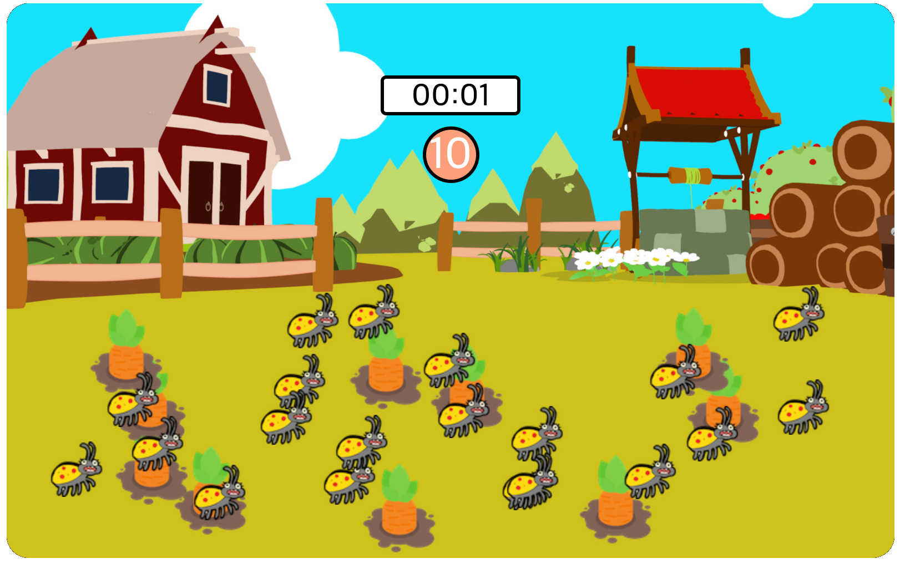
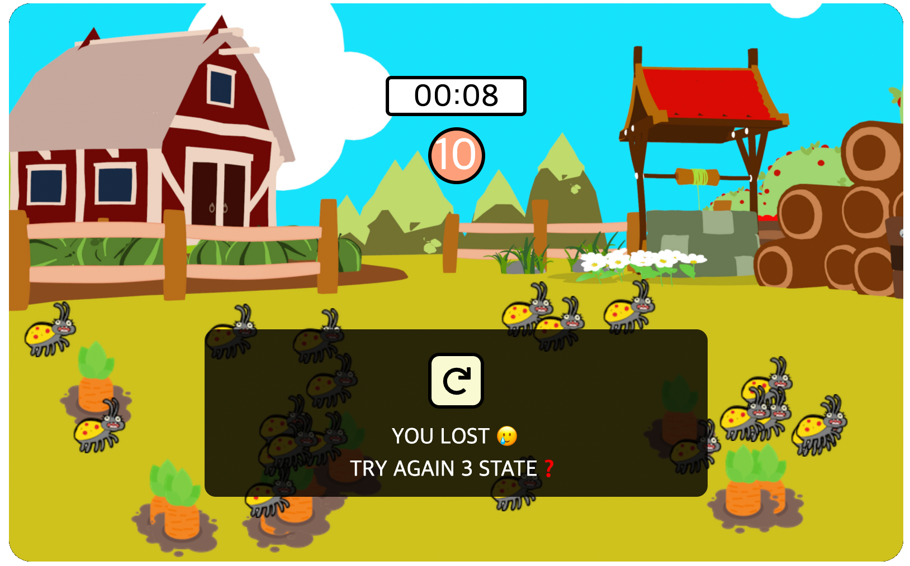

## 바닐라JS를 이용해 만드는 carrot game🎮

## 프로젝트 소개 
시간내에 모든 당근을 클릭하면 다음단계로 넘어가는 미니게임입니다.  
총 3단계로 이루어져 있으며, 실행중인 단계에서 실패할 경우 현재의 단계를 다시 실행 할 수 있습니다. 

<figure>
        
</figure>

## 개발 내용 
📖 첫 구현시 프로젝트 실행 영상을 보고, 혼자 구현해 보았습니다.  
이후 강의를 보며 관심사의 분리, 빌더패턴을 적용하여 클론 코딩하였습니다. 

📖 두번째 구현시에 다시 초기 상태로 돌아가서 미흡하지만 강의에서 배웠던 관심사의 분리를 적용해보았습니다. 기존 프로젝트에는 없었던 게임stage 별 난이도를 추가하였습니다. 마지막으로 주변에서 피드백을 받아 오류를 수정하였습니다.  
  
❗️오류내용  
* 게임 종료후 팝업화면에서 당근, 벌레 이미지가 클릭 되는 현상  
* 3단계에서 난이도의 변화는 없으나 계속 게임state가 증가하는 오류  
 

## 기술스택 
- HTML, CSS, JAVASCRIPT

## 게임 페이지🔗 
- https://salangdung-i.github.io/carrot-game/

## Screen Shot 📸
<figure>
   
    <figcaption>게임 중 화면 </figcaption>
</figure>

<figure>
     
    <figcaption>다음 레벨 선택화면</figcaption>
</figure>

<figure>
    
    <figcaption>실패후 다음레벨 선택화면 </figcaption>
</figure>

